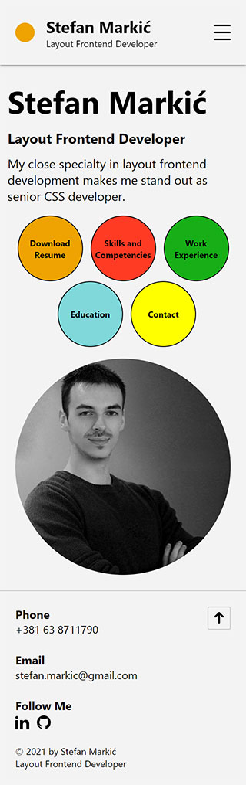
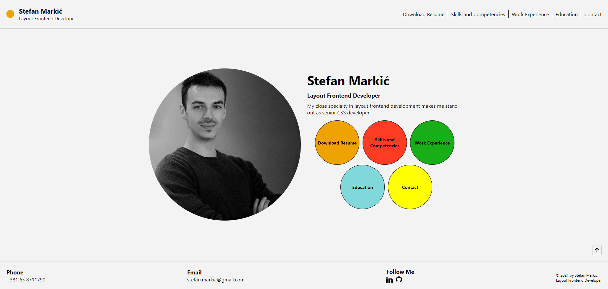

# Web version of my CV

## Setting up your system

In order to successfully run and manage this project, it is recommened to use Node 12.16.3. That is the version this project was initiliazed with and built upon.

If you're feeling uncomfortable about changing Node version on your system, it is recommended to use Node Version Manager (NVM).

- [Download NVM for Windows here](https://github.com/coreybutler/nvm-windows)
- [Download NVM for Linux and macOS here](https://github.com/nvm-sh/nvm)

Once you install NVM, run `nvm list` command. This will show you all Node versions that you currently have installed on you system. Run `nvm list available` in order to see which versions are curently available for download. Note that you can also install Node versions which are not listed by `nvm list available` command. [Check here](https://nodejs.org/en/download/releases/) for a full list of all Node versions avilable for download.

- Run `nvm install 12.16.3`
- Run `nvm use 12.16.3`
- Run `nvm list` to check if your system is using the recommened Node version for this project.

## Running the project

After you run `npm install` command to pull all the necessary NPM packages, you have three commands available:
- `gulp develop`
- `gulp build`
- `gulp test`

As the command name implies, `gulp develop` will set you up for development, with browser sync reload every time you save a file within `src` project folder.

`gulp build` command will minify all HTML and CSS files and move them to production-ready `dist` folder, along with other asset files such as images, documents and fonts.

To make sure that everything is in order before deploying to production, you can also run `gulp test` command. This command will simply run a new localhost on your system where you can check all HTML templates directly from production-ready `dist` folder.

## Testing

If you only wish to check the HTML templates from the end user's perspective, it is highly recommended that you do it by running `gulp test` command in order to get the full experience, rather than just opening HTML files from `dist` folder directly on your file system. The reason for this is that JavaScript will not work from local file system due to security reasons, which is why `gulp test` command opens up a dedicated port and runs a localhost on your system.

## Some of the project image previews

### Small screen devices

### Medium screen devices

### Large screen devices

